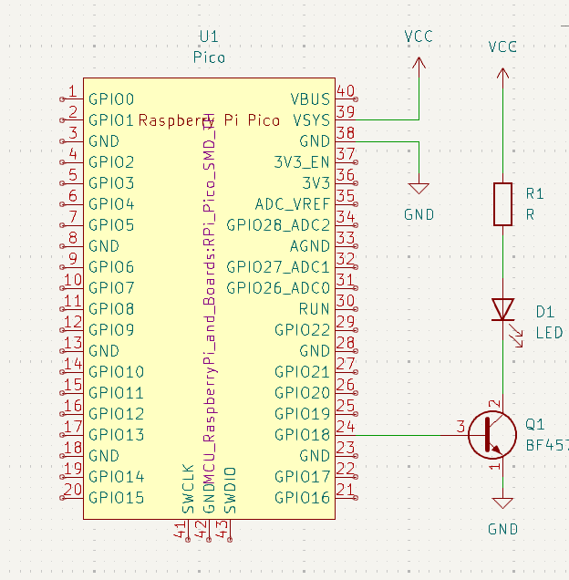
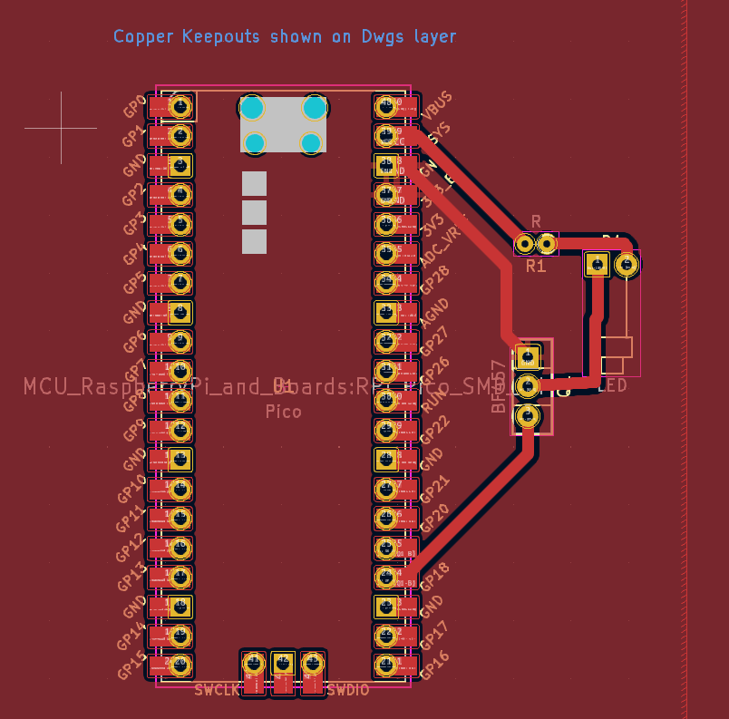
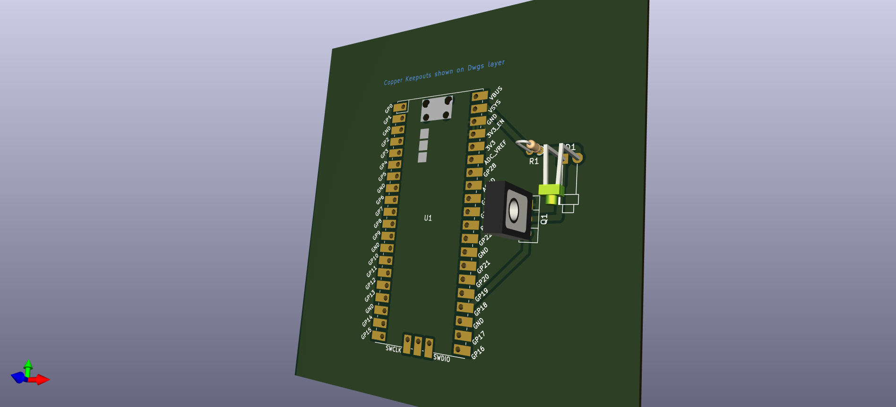

# Placa de circuito impresso com Raspberry Pi Pico

Disposição geral do repositório, com os diretórios e seus respectivos arquivos:
```
│   README.md
│
├───src
│       fp-info-cache
│       ponderadaPcb-B_Cu.gbr
│       ponderadaPcb-B_Mask.gbr
│       ponderadaPcb-B_Paste.gbr
│       ponderadaPcb-B_Silkscreen.gbr
│       ponderadaPcb-Edge_Cuts.gbr
│       ponderadaPcb-F_Cu.gbr
│       ponderadaPcb-F_Mask.gbr
│       ponderadaPcb-F_Paste.gbr
│       ponderadaPcb-F_Silkscreen.gbr
│       ponderadaPcb-job.gbrjob
│       ponderadaPcb.kicad_pcb
│       ponderadaPcb.kicad_prl
│       ponderadaPcb.kicad_pro
│       ponderadaPcb.kicad_sch
│       ~ponderadaPcb.kicad_sch.lck
│
└───static
    └───img
            3d.png
            esquematico.png
            pcb.png
```


Dentro do diretório "src", há alguns arquivos importantes para considerar, a saber:
1. gbr: arquivos com essa terminação se referem aos arquivos Gerber, que são importantíssimos arquivos para a fabricação de PCB, pois descrevem os vários elementos e constituintes da placa de circuito impresso;
2. kicad_pcb: o arquivo com essa terminação se refere ao design da PCB;
3. kicad_pro: o arquivo com essa terminação se refere ao design final do projeto;
4. kicad_sch: o arquivo com essa terminação se refere ao esquemático da PCB.

O projeto contou com os seguintes componentes:
- Raspberry Pi Pico;
- Trasnsistor;
- LED;
- Resistor.

A seguir, imagens do esquemático, do design PCB e da visualização 3D, respectivamente:





